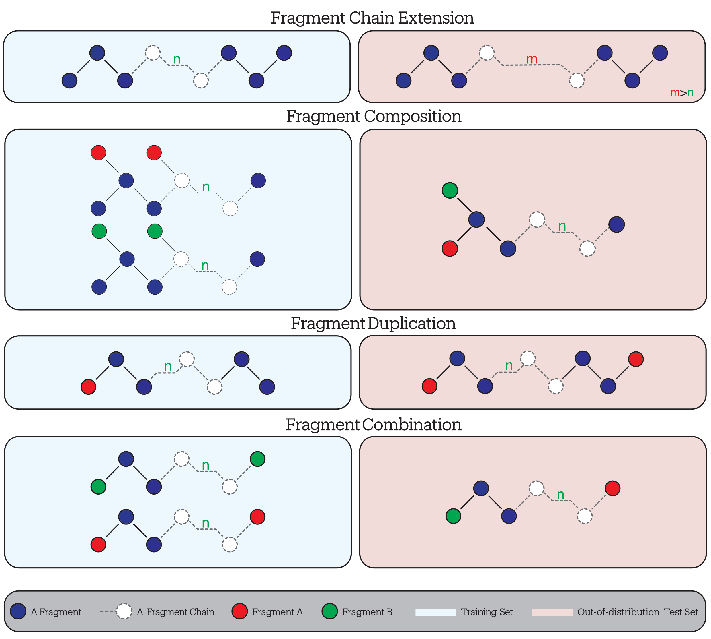
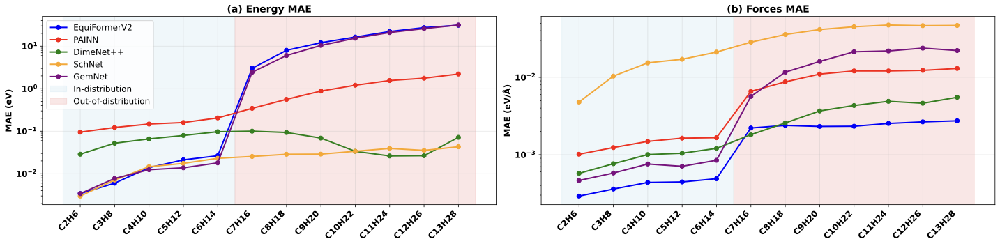

## Overview {data-section="Overview"}

:::::: {.columns}
::: {.column width="10%"}
:::
::: {.column width="80%"}
<br>

1. **The Current State of MLIPs**  
   <span style="color:var(--ufc-muted);font-size:0.85em;">Neural potentials, the black-box problem, and systemic extrapolation failure</span>

2. **The Data-Evaluation Paradox**  
   <span style="color:var(--ufc-muted);font-size:0.85em;">Why standard benchmarks cannot measure generalisation</span>

3. **GMD-26: A Framework for Systematic Evaluation**  
   <span style="color:var(--ufc-muted);font-size:0.85em;">Our benchmark, four tasks, and key results</span>

4. **The DeepSet-MoE**  
   <span style="color:var(--ufc-muted);font-size:0.85em;">Proposed architecture for interpretable generalisation</span>

5. **Conclusion & Future Outlook**  
   <span style="color:var(--ufc-muted);font-size:0.85em;">Key findings and next steps</span>
:::
::::::

## Neural Network Architectures in Chemistry {data-section="The Current State of MLIPs"}

Neural networks in chemistry can be categorised by their resolution and computational cost:

- **Quantum Chemistry Methods** *(e.g., PauliNet)*
- **Semi-Empirical Methods** *(e.g., NN-xTB)*
- **Coarse-Grained Methods** *(e.g., CGNet)*
- **Force Field Methods** *(e.g., SchNet)*

<br>

::: {.fragment}
::: {.callout-note appearance="minimal" icon=false}
Force field methods, or **Machine-Learned Interatomic Potentials (MLIPs)**, are currently the most widely adopted approach. They offer an optimal trade-off between **computational complexity** and **predictive accuracy**.
:::
:::

## Impact of MLIPs in Computational Chemistry {data-section="The Current State of MLIPs"}

:::: {.columns}
::: {.column width="48%"}
::: {.fragment}
**Bridging the Gap**

- MLIPs maintain *ab initio* accuracy while matching the **efficiency** of classical force fields.
- **Scaling Advantage:** DFT scales cubically ($O(N^3)$), whereas MLIPs scale linearly ($O(N)$), preventing cost explosion for large systems.
:::
:::
::: {.column width="48%"}
::: {.fragment}
**[Computational Breakthroughs]{style="color:var(--ufc-main)"}**

1. **Drastic Acceleration:** Achieving speedups of **$10^5\times$** compared to standard DFT.
2. **Overcoming Intractability:** Simulations requiring **decades** of DFT compute time can be completed in days.
3. **Resource Efficiency:** High-fidelity MD is now feasible on consumer GPUs rather than massive HPC clusters.
:::
:::
::::

## The Ambiguity of Learned Representations {data-section="The Current State of MLIPs"}

<span class="bodytext">The shift from fixed descriptors to **learnable representations** has traded transparency for accuracy, creating a fundamental "Black Box" problem:</span>

:::: {.columns}
::: {.column width="48%"}
::: {.fragment}
**1. The Latent Space "Black Box"**

- Unlike descriptor-based models (using clear physical quantities), end-to-end architectures map atoms to **abstract latent vectors**.
- These high-dimensional representations are opaque; it is effectively impossible to **disentangle** which physical features the model has learned.
:::
:::
::: {.column width="48%"}
::: {.fragment}
**2. The Mapping Problem**

- Even in large-scale **Foundation Models**, the mapping between data and representation remains hidden.
- It is unclear if the model has constructed a continuous, valid **Chemical Space**, or merely memorised disjointed training manifolds.
:::
:::
::::

## The Consequence: Systemic Extrapolation Failure {data-section="The Current State of MLIPs"}

<span class="bodytext">Because the learned representation is opaque, we cannot define its validity domain. This leads to critical failures that standard metrics fail to detect:</span>

:::: {.columns}
::: {.column width="48%"}
::: {.fragment}
**1. The Extrapolation Catastrophe**

- **Undefined Boundaries:** Models cannot signal when they leave the training domain. They "hallucinate" interactions for unseen chemical species.
- **Physics Violation:** The opaque latent space often maps valid geometric distortions to unphysical energy surfaces, leading to unstable dynamics in OOD settings.
:::
:::
::: {.column width="48%"}
::: {.fragment}
**2. The Evaluation Blind Spot**

- **The Interpolation Trap:** Standard benchmarks (e.g., MD17, QM9) rely on ID splits. This rewards models for **memorising** the local manifold rather than learning transferable principles.
- **False Security:** High accuracy on these datasets masks the model's inability to generalise compositionally to larger or more complex systems.
:::
:::
::::

## Landscape of Established Datasets {data-section="The Data-Evaluation Paradox"}

<span class="bodytext">Existing benchmarks were designed for accuracy — not for probing **compositional generalisation**.</span>

The field has evolved from small, specific datasets to massive, heterogeneous aggregates:

:::: {.columns}
::: {.column width="32%"}
::: {.fragment}
<div style="text-align:center;">**1. Single-System MD**  
*MD17 · rMD17*</div>

Trajectories of single small molecules (Ethanol, Aspirin).

- **Focus:** Learning the force field of a *specific* molecule.
- **Limit:** Models overfit to "that aspirin" and fail to transfer.
:::
:::
::: {.column width="32%"}
::: {.fragment}
<div style="text-align:center;">**2. Static Equilibrium**  
*QM9 · OE62*</div>

Properties for thousands of stable organic molecules.

- **Focus:** Predicting properties of relaxed geometries.
- **Limit:** Lacks the distorted geometries needed for reaction dynamics.
:::
:::
::: {.column width="34%"}
::: {.fragment}
<div style="text-align:center;">[**3. Massive Aggregates**]{.accent}  
*OMat24 · MPtrj*</div>

Huge, heterogeneous collections mixing equilibrium and non-equilibrium data.

- **Focus:** Training general-purpose **Foundation Models**.
- **Limit:** Unstructured coverage; difficult to audit for systematic OOD gaps.
:::
:::
::::

::: {.fragment}
<div class="gap-note">
**Gap:** *Despite the scale of Category 3, we still lack systematic benchmarks designed to specifically stress-test **compositional extrapolation**.*
</div>
:::

## The Data-Evaluation Paradox {data-section="The Data-Evaluation Paradox"}

While datasets have scaled massively to create "Universal" models, evaluation protocols remain fundamentally flawed:

:::: {.columns}
::: {.column width="48%"}
::: {.fragment}
**1. The Scale of Data**

Modern efforts aim for universal coverage using massive, heterogeneous aggregates:

- **Organic:** ANI-1x (20M+ conformations).
- **Materials:** MPtrj (Inorganic trajectories).
- **Surfaces:** Open Catalyst (Millions of relaxations).
:::
::: {.fragment}
<div style="text-align:center;margin:0.6em 0;font-size:0.95em;color:var(--ufc-main);font-weight:700;">→ Assumption: "More data automatically yields better physical understanding."</div>
:::
:::
::: {.column width="48%"}
::: {.fragment}
[**2. The Evaluation Deficit**]{.accent}

**A. The In-Distribution Trap:**

- Random splits test **memorisation** of the local manifold, not physical learning.

**B. The "Ineffective" OOD Solution:**

- Existing benchmarks use **arbitrary** splits rather than systematic variations.
- **Opacity:** They cannot quantify *where* in chemical space the model fails.
:::
:::
::::

::: {.fragment}
<div class="gap-note">
**The Critical Gap:** *We lack a metric to measure **how far** a model can extrapolate. We define OOD loosely ("unseen"), rather than mathematically ("distance from training manifold").*
</div>
:::

## Introducing GMD-26: A Framework for Generalisation {data-section="GMD-26"}

<span class="bodytext">We introduce **GMD-26** not merely as a dataset, but as a flexible **Benchmarking Framework** designed to rigorously quantify generalisation.</span>

:::: {.columns}
::: {.column width="48%"}
::: {.fragment}
**1. The Protocol (Domain-Agnostic)**

A systematic structure adaptable to diverse fields (e.g., Polymers, Proteins):

- **4 Systematic Tasks:** Defined by specific compositional shifts rather than random splits.
- **2 Subtasks:** Targeted probes for specific failure modes.
- **Philosophy:** Testing *physical principles* (transferable) vs. *memorisation*.
:::
:::
::: {.column width="48%"}
::: {.fragment}
**2. Reference Implementation**

Validation via **Small Organic Molecules**:

- **Tractable Systems:** Small molecules provide interpretable, clear failure modes.
- **Multi-Trajectory Challenge:** Unlike MD17, we use *multiple diverse trajectories*. This forces models to learn the potential surface, not just a single path.
- **Fidelity Status:** Currently generated at **GFN2-xTB** level; active upgrade to **DFT** is underway to support Foundation Models.
:::
:::
::::

::: {.fragment}
<div class="gap-note">
**Goal:** *To establish a universal standard for auditing model robustness across any chemical domain.*
</div>
:::

## GMD-26: The Four Systematic Generalisation Tasks {data-section="GMD-26"}

{fig-align="center" width="93%"}

## Results: The "Duplication" Challenge {data-section="GMD-26"}

**Task Definition:** Training on molecules with a **single fragment A** (e.g., Mono-acid) and testing on molecules with **two** of the same **fragment A** (e.g., Di-acid).

<br>

```{=html}
<table class="results-table" style="width:100%;font-size:0.72em;border-collapse:collapse;text-align:center;">
  <thead>
    <tr>
      <th rowspan="2" style="text-align:left;padding:4px 6px;border-bottom:2px solid #8b1538;">Model</th>
      <th colspan="2" style="border-bottom:1px solid #ccc;padding:4px 6px;">Forces MAE</th>
      <th colspan="2" style="border-bottom:1px solid #ccc;padding:4px 6px;">Cosine Sim.</th>
      <th colspan="2" style="border-bottom:1px solid #ccc;padding:4px 6px;">F Mag. MAE</th>
      <th colspan="2" style="border-bottom:1px solid #ccc;padding:4px 6px;">Energy MAE (eV)</th>
    </tr>
    <tr>
      <th style="padding:3px 6px;border-bottom:2px solid #8b1538;">ID</th>
      <th style="padding:3px 6px;border-bottom:2px solid #8b1538;">OOD</th>
      <th style="padding:3px 6px;border-bottom:2px solid #8b1538;">ID</th>
      <th style="padding:3px 6px;border-bottom:2px solid #8b1538;">OOD</th>
      <th style="padding:3px 6px;border-bottom:2px solid #8b1538;">ID</th>
      <th style="padding:3px 6px;border-bottom:2px solid #8b1538;">OOD</th>
      <th style="padding:3px 6px;border-bottom:2px solid #8b1538;">ID</th>
      <th style="padding:3px 6px;border-bottom:2px solid #8b1538;">OOD</th>
    </tr>
  </thead>
  <tbody>
    <tr><td style="text-align:left;padding:3px 6px;">SchNet</td><td>0.0292</td><td>0.1143</td><td>0.9979</td><td>0.9691</td><td>0.0307</td><td>0.1458</td><td>0.0295</td><td>29.32</td></tr>
    <tr style="background:#f9f9f9;"><td style="text-align:left;padding:3px 6px;">PaiNN</td><td>0.0020</td><td>0.0600</td><td>0.9999</td><td>0.9768</td><td>0.0022</td><td>0.0713</td><td>0.0181</td><td>30.72</td></tr>
    <tr><td style="text-align:left;padding:3px 6px;">GemNet</td><td>0.0009</td><td>0.0224</td><td>0.9999</td><td>0.9978</td><td>0.0010</td><td>0.0223</td><td>0.0129</td><td>12.27</td></tr>
    <tr style="background:#f9f9f9;"><td style="text-align:left;padding:3px 6px;">EquiFormerV2</td><td>0.0018</td><td>0.0538</td><td>0.9999</td><td>0.9746</td><td>0.0019</td><td>0.0603</td><td>0.0984</td><td style="color:#8b1538;font-weight:700;">133.77</td></tr>
    <tr><td style="text-align:left;padding:3px 6px;">DimeNet<sup>++</sup></td><td>0.0018</td><td>0.2484</td><td>0.9999</td><td>0.9406</td><td>0.0019</td><td>0.3863</td><td>0.0128</td><td>34.86</td></tr>
    <tr style="background:#f9f9f9;"><td style="text-align:left;padding:3px 6px;"><strong>MACE</strong></td><td>0.0028</td><td><strong>0.0171</strong></td><td>0.9999</td><td><strong>0.9978</strong></td><td>0.0030</td><td><strong>0.0201</strong></td><td>0.0018</td><td style="color:#8b1538;font-weight:700;"><strong>40.97</strong></td></tr>
    <tr><td style="text-align:left;padding:3px 6px;">NequIP</td><td>0.0256</td><td>0.0460</td><td>0.9984</td><td>0.9922</td><td>0.0269</td><td>0.0501</td><td>0.0198</td><td>34.59</td></tr>
  </tbody>
  <tfoot>
    <tr><td colspan="9" style="text-align:left;font-size:0.88em;color:#6f6f6f;padding-top:6px;border-top:1px solid #ccc;">Detailed performance metrics on the Fragment Duplication task. Values in <span style="color:#8b1538;font-weight:700;">red</span> indicate catastrophic OOD failure.</td></tr>
  </tfoot>
</table>
```

## Results: The "Chain Extension" Challenge {data-section="GMD-26"}

{fig-align="center" width="93%"}

## Proposed Architecture: The DeepSet-MoE {data-section="The DeepSet-MoE"}

<span class="bodytext">We implement the **DeepSet** framework ($E = \rho(\sum \phi)$), modifying the pipeline to expose interpretability and challenge standard assumptions:</span>

:::: {.columns}
::: {.column width="36%"}
::: {.fragment}
<div style="text-align:center;"><strong style="font-size:1.1em;">1. Encoder ($\phi$)</strong></div>

**Architecture:** Mixture of Experts (MoE) replacing the monolithic network.

<span class="accent">Refined Routing Metrics:</span>

- **Metric A (Spatial):** Experts activated by *pairwise distances* (replacing the previous dual-cutoff).
- **Metric B (Identity):** Experts assigned by *central atom type*. One expert processes all hierarchies.
:::
:::
::: {.column width="32%"}
::: {.fragment}
<div style="text-align:center;"><strong style="font-size:1.1em;">2. Aggregation ($\sum$)</strong></div>

**Role:** Pooling atomic states into a global representation.

<span class="accent">Current State:</span>

- Standard Summation.

<span class="accent">The Aggregation Hypothesis:</span>

- **Hypothesis:** Rigid summation **obscures** distinct atomic contributions.
- **Experiment:** Removing the Aggregation Head entirely.
:::
:::
::: {.column width="29%"}
::: {.fragment}
<div style="text-align:center;"><strong style="font-size:1.1em;">3. Decoder ($\rho$)</strong></div>

**Role:** Mapping latent state to Energy/Force.

<span class="accent">Inference:</span>

- Currently Identity (Direct).
- **Goal:** Eliminate ambiguity by inferring directly from Encoder output.
:::
:::
::::

## Summary: The Generalisation Crisis {data-section="Conclusion"}

::: {.fragment}
::: {.callout-note appearance="minimal" icon=false}
**The Diagnosis**

We challenged the generalisation capabilities of established SOTA architectures by introducing **GMD-26**, a benchmark designed to test physical robustness rather than memorisation.
:::
:::

<br>

::: {.fragment}
**Key Findings:**
:::

::: {.fragment}
- **Universal Failure:** Every evaluated architecture — from simple invariant models (SchNet) to equivariant transformers (EquiFormerV2) and high-order bodies (MACE) — failed to generalise compositionally.
:::

::: {.fragment}
- **The Magnitude of Error:** OOD errors were not merely higher; they were catastrophic (often **orders of magnitude** larger than ID errors), proving that excellent performance on standard benchmarks masks a critical lack of physical understanding.
:::

## Future Outlook: Toward Interpretable Generalisation {data-section="Conclusion"}

<span class="bodytext">To bridge this gap, we are moving away from monolithic "Black Box" networks toward a modular, chemically aligned architecture:</span>

:::: {.columns}
::: {.column width="48%"}
::: {.fragment}
**1. The DeepSet-MoE Implementation**

- **Specialised Encoding:** Replacing the single encoder with a **Mixture of Experts** routed by optimised physical metrics.
- **Goal:** To ensure distinct chemical environments are processed and learned by distinct, specialised parameters.
:::
:::
::: {.column width="48%"}
::: {.fragment}
**2. The Aggregation Hypothesis**

- **Current Bottleneck:** We suspect the rigid summation ($\sum$) obscures the distinct share of atomic contributions.
- **Next Step:** We are currently investigating alternative aggregation paradigms to identify a strategy that preserves distinct atomic contributions within the global prediction.
:::
:::
::::

<br>

::: {.fragment}
<div class="gap-note">
**Final Conclusion:** *We aim to establish DeepSet-MoE as an explainable architecture where OOD performance remains close to ID levels, prioritising this **generalisation stability** over chasing the absolute lowest ID errors seen in SOTA models.*
</div>
:::

## Thank You {data-section="Thank You"}

:::::: {.columns}
::: {.column width="10%"}
:::
::: {.column width="80%"}
<br><br>

<div style="text-align:center;">

**Amir Masoud Nourollah**

<span style="color:var(--ufc-muted);">PhD Student · Cardiff NLP & Knowledge Representation and Reasoning Groups</span>

<br>

*Supervisors:* Prof. Stefano Leoni · Prof. Steven Schockaert

<br>

📧 [NourollahA@cardiff.ac.uk](mailto:NourollahA@cardiff.ac.uk)  
🌐 [nourollah.me](https://nourollah.me)

<br><br>

<span style="font-size:0.8em;color:var(--ufc-muted);">Preprint available at [arxiv.org/abs/2605.08988](https://arxiv.org/abs/2605.08988)</span>

</div>
:::
::::::
